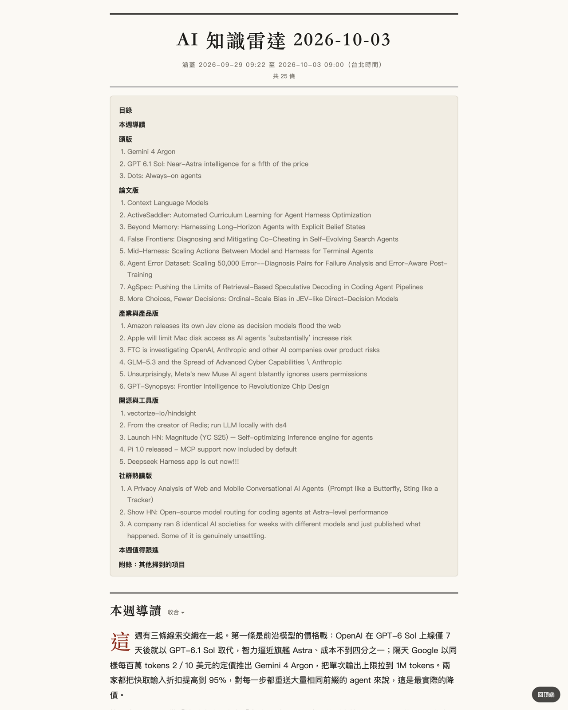
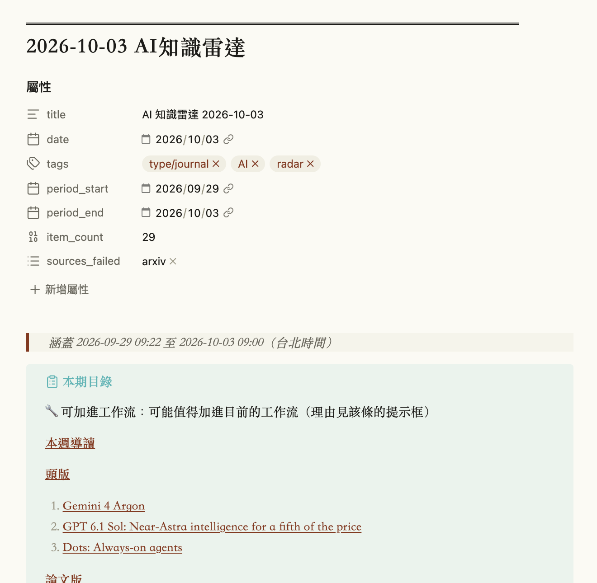
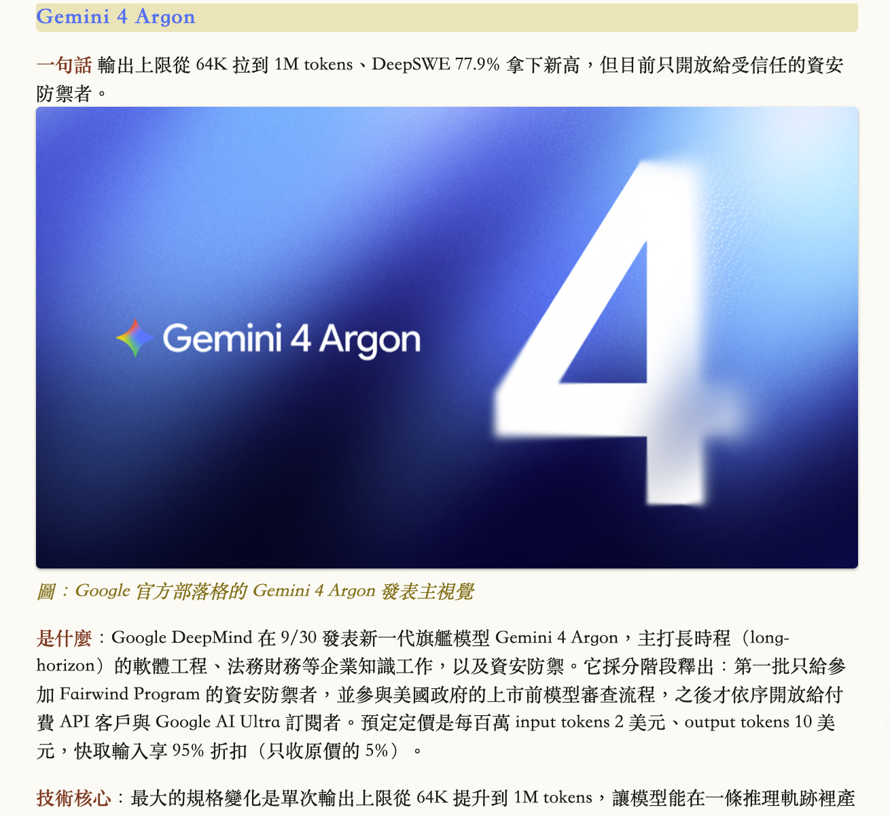
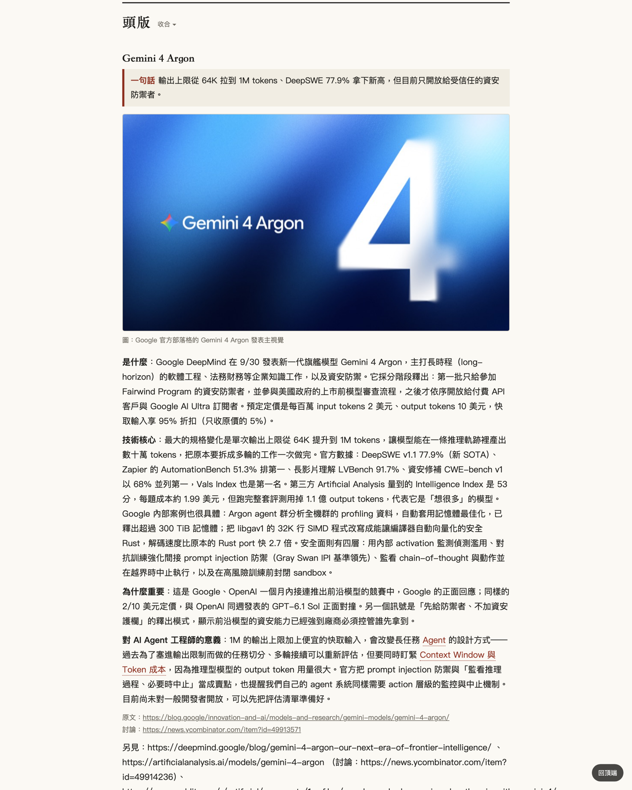
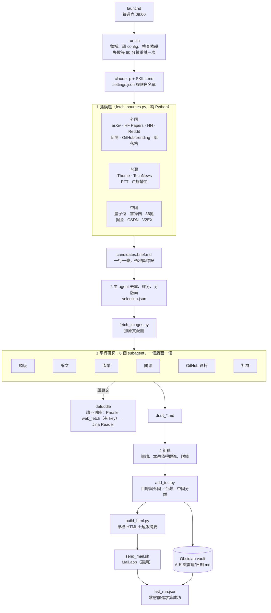

# ai-radar：AI 知識雷達週報

> **English** — ai-radar is a Claude Code skill that runs unattended every Saturday on macOS. It scans the past week's AI papers, news, open-source projects and developer discussions across English, Taiwanese and Simplified-Chinese sources (12 sources, several hundred candidates). It picks the items that matter for AI agent engineers, sends six parallel subagents to read each original source in full, and writes a newspaper-style weekly report into an Obsidian vault. It can also mail a short digest with a self-contained HTML edition. It runs through `claude -p` with a permission allowlist instead of skipping permissions. It retries once on failure and treats a run as successful only when its state file advances. Installation is agent-driven: hand this repo's URL to Claude Code and it follows [`INSTALL.md`](INSTALL.md).



一個 Claude Code skill。每週六 09:00 由 macOS launchd 自動執行，掃描上次執行到現在的 AI 論文、論壇、新聞與開源動態，深入研究後產出一份報紙式週報，寫進你的 Obsidian vault；可選擇同時用 Mail.app 寄一封短版信（附完整 HTML 版）。

## 週報長什麼樣子

每期一個檔案：`<vault>/AI知識雷達/<日期> AI知識雷達.md`，開頭是本週導讀與目錄，接著六個版面：

1. 頭版：本週最重要的 1–3 件事
2. 論文版
3. 產業與產品版：模型發布、公司動態、政策
4. 開源與工具版：GitHub、框架、本地部署
5. GitHub AI Agent 週榜：本週新增星數最多的 5 個 agent 相關 repo
6. 社群熱議版：HN、Reddit、PTT、掘金、V2EX 等討論，以及工程師的實作心得

產業、開源、社群三個版面依來源地分成「外國／台灣／中國」三群。

每一條都固定寫成：一句話結論、原文配圖、「是什麼／技術核心／為什麼重要／對 AI Agent 工程師的意義」四段，附原文與討論連結。同一期有兩種樣子：寫進 vault 的 Obsidian 筆記（目錄是同頁連結、配圖存在 `attachments/`），以及寄信時附上的單檔 HTML（圖片內嵌、報紙排版）：

| Obsidian | HTML（信件附件） |
|---|---|
|  |  |
|  |  |

（截圖為 2026-10-03 那期；條目內的圖片取自各原文出處。）

## 來源與讀取方式

先由 `fetch_sources.py` 抓候選（只用公開 API、RSS 與列表頁，不需要任何 key），入選的條目再由 subagent 讀原文全文。讀原文時先用 `defuddle`；遇到擋爬蟲或要跑 JavaScript 的頁面才「補抓」，有沒有 Parallel API key 只影響補抓這一步：

- **有 Parallel key**：Parallel `web_fetch`，失敗再用 Jina Reader。
- **沒有 key**：只用 Jina Reader（免 key，約每分鐘 20 次；設 `JINA_API_KEY` 環境變數可提高額度）。

| 地區 | 來源 | 讀原文方式 | 有 Parallel | 沒有 Parallel |
|---|---|---|---|---|
| 外國 | arXiv、Hugging Face Papers | defuddle（abs 頁／論文頁） | ✅ | ✅ |
| 外國 | Hacker News | defuddle（原文＋討論串） | ✅ | ✅ |
| 外國 | Reddit（r/LocalLLaMA、r/MachineLearning、r/artificial） | Reddit 擋所有抓取工具 | ⚠️ 只依摘要 | ⚠️ 只依摘要 |
| 外國 | 新聞（TechCrunch、The Verge、OpenAI、Google DeepMind、Meta） | defuddle；擋爬蟲的官網走補抓 | ✅ Parallel | ✅ Jina |
| 外國 | GitHub trending、AI Agent 週榜 | defuddle（README） | ✅ | ✅ |
| 外國 | Medium 出版物（Towards AI 等 4 個） | RSS 內附全文 | ✅ | ✅ |
| 外國 | dev.to、Hugging Face 部落格、Simon Willison、Lobsters | defuddle | ✅ | ✅ |
| 台灣 | iThome、TechNews 科技新報 | defuddle | ✅ | ✅ |
| 台灣 | PTT（Soft_Job、AI 板）、iT邦幫忙 | defuddle | ✅ | ✅ |
| 中國 | 量子位、雷锋网、CSDN 熱榜 | defuddle | ✅ | ✅ |
| 中國 | 36氪 | RSS 內附全文 | ✅ | ✅ |
| 中國 | V2EX | 官方 API（內文＋回覆） | ✅ | ✅ |
| 中國 | 掘金 | 頁面要跑 JavaScript，直接補抓 | ✅ Parallel | ✅ Jina |

兩條路徑涵蓋的來源相同，差別在補抓的穩定度與速度：Jina 有每分鐘次數上限，補抓多的週次會慢一些，偶爾讀不到的條目會改依摘要撰寫並標上「僅依摘要」。Medium 只收出版物 RSS 每個 feed 最新 10 篇（本站擋爬蟲）；Facebook、Threads、Instagram、知乎、Dcard 擋抓取或要登入，沒有收錄。

如果你填了 `harness_profile.md`（你自己的 AI 工作流現況），能直接裝進你工作流的條目會多一個「可加進工作流」標記。

## 架構



幾個設計重點：

- **無人值守但不放權**：`claude -p` 搭配 `settings.json` 白名單，只允許特定腳本、指令和 vault 資料夾；不用 `--dangerously-skip-permissions`。
- **確定性的部分交給腳本**：抓來源、分頁、日期過濾、目錄與 HTML 都是 Python，模型只做挑選、閱讀與撰稿。
- **主 agent 只讀摘要**：候選清單壓成一行一條的 brief，完整 JSON 依版面切檔交給 subagent，主 context 不被幾百條原始資料塞滿。
- **外部內容當資料**：抓回來的網頁、討論串一律只是報導對象，裡面的指令不照做（防 prompt injection）。
- **成功的定義可驗證**：`run.sh` 不看 exit code，看狀態檔有沒有前進；沒寄出（或沒寫完）就重試一次，再失敗就寄信或跳通知。

## 需求

- macOS（排程用 launchd，寄信用 Mail.app）
- Claude Code 已安裝並登入。每週的自動執行是 launchd 呼叫 `claude -p`，用的是你的 Claude Code 登入與方案額度
- 方案額度要夠：一次執行會派 6 個 subagent 平行研究，約 30–60 分鐘
- `python3`、`uv`、`defuddle`（安裝時 Claude Code 會幫你檢查、問過你再補）
- 選用：Parallel API key（抓網頁比較穩；沒有也能跑，改用備援抓取）
- 選用：寄信需要 Mail.app 已登入寄件帳號
- 已知上限：來源本身都是 AI 綜合來源，自訂讀者與主題只影響篩選、評分與撰稿角度；「GitHub AI Agent 週榜」固定是 agent 主題

## 安裝

在 Claude Code 裡說：

> 照 `https://github.com/dk40913/ai-radar` 的 INSTALL.md 安裝 ai-radar

它會問你幾件事（Obsidian vault 路徑、要不要寄信與寄到哪、有沒有 Parallel API key、要不要順便裝 Obsidian skills 套件、週報要以誰的角度與關注哪些主題（直接用預設＝AI Agent 工程師）；安裝它的若是 Fable，也會問你要不要改用 Opus 省額度），然後 clone、安裝、驗證。vault 路徑例如 `~/Documents/Obsidian`。

Obsidian 這邊不用做任何設定，週報格式由 skill 產生。週報很長，想要「回到頂端」按鈕可以另裝社群插件 Scroll to Top（選用）。

## 安裝後的檔案

| 位置 | 內容 |
|------|------|
| `~/.claude/skills/ai-radar/` | skill 本體與腳本 |
| `~/.claude/skills/ai-radar/config.json` | 設定：vault、收件者、模型、是否用 Parallel、工具所在目錄、讀者與關注主題 |
| `~/.claude/skills/ai-radar/harness_profile.md` | 你的工作流現況（可自行改寫） |
| `~/Library/LaunchAgents/com.<你的帳號>.ai-radar.plist` | 每週六 09:00 的排程 |
| `~/.local/state/ai-radar/` | 上次執行時間與每次執行的中間檔 |
| `~/Library/Logs/ai-radar.log` | 執行 log |
| `<vault>/AI知識雷達/` | 週報、圖片與該資料夾的撰寫規範 `CLAUDE.md` |

`config.json` 裡 `mail_to` 留空＝不寄信；`model` 留空＝用 Claude Code 預設模型；`path_prepend` 是安裝時找到 `claude`、`defuddle`、`uv`、`python3` 的目錄，排程執行時會放在 PATH 最前面（之後搬動或重裝這些工具，就重跑 `install.sh`）。

### 換模型

排程用的模型是安裝時 `--model` 給的那個。要換的話，用新的 `--model` 重跑 `install.sh`（其他旗標照舊）；給空字串 `--model ""` 則改用 Claude Code 的預設模型。每次執行會派 6 個 subagent，它們用的模型由 `--subagent-model`（`opus`／`sonnet`／`haiku`）決定，換成較小的模型可以省額度。

### 換主題

週報的讀者與關注主題是安裝時 `--reader`、`--focus`、`--arxiv-keywords`（逗號分隔的 arXiv 篩選關鍵字）給的那些。要換的話，帶新的值重跑 `install.sh`；跟其他旗標一樣每次都要帶齊，不帶就回到預設（AI Agent 工程師，關注 AI Agent、LLM 推論與部署、RAG、本地模型、agent 框架與工具，arXiv 用內建關鍵字）。

### 第一次排程執行的權限

第一次由排程自動執行時，macOS 可能會跳出視窗，詢問是否允許存取「文件」資料夾或 iCloud Drive（vault 放在那裡時）。如果第一次排程執行因權限錯誤失敗（log 裡出現 `Operation not permitted` 之類的訊息），到「系統設定 › 隱私權與安全性」把存取權限開給相關程式（例如「完整磁碟取用權限」或「檔案與資料夾」裡的 `bash`、`claude`），再手動跑一次確認。

## 日常使用

- 自動：每週六 09:00 執行。Mac 當時在睡眠的話，醒來後補跑。
- 手動跑一次：

  ```bash
  ~/.claude/skills/ai-radar/scripts/run.sh
  ```

  可加 `since=YYYY-MM-DD` 指定起始日。也可以在 Claude Code 裡直接打 `/ai-radar`。
- 看執行狀況：`tail -f ~/Library/Logs/ai-radar.log`。失敗時會跳出 macOS 通知，有設收件者的話也會寄一封失敗通知。
- 「可加進工作流」標記：改寫 `~/.claude/skills/ai-radar/harness_profile.md`，把範本裡的 `（填：…）` 換成你自己的環境。檔案刪掉或沒填就不會出現這個標記。

## 更新

```bash
cd ~/project/ai-radar   # 你 clone 的位置
git pull
./install.sh --vault <同樣的 vault> --parallel <yes|no> [其他當初用的旗標]
```

重跑 `install.sh` 是安全的：設定檔依旗標重寫，`harness_profile.md` 與 vault 裡的 `CLAUDE.md` 不會被覆蓋。

## 移除

```bash
launchctl bootout gui/$(id -u)/com.$USER.ai-radar
rm ~/Library/LaunchAgents/com.$USER.ai-radar.plist
rm -rf ~/.claude/skills/ai-radar ~/.local/state/ai-radar
```

vault 裡的 `AI知識雷達/` 資料夾是你的週報，要留要刪自己決定。有設 Parallel MCP 而且不再需要的話：`claude mcp remove --scope user Parallel-Search-MCP`。

## 授權

MIT，見 [LICENSE](LICENSE)。
